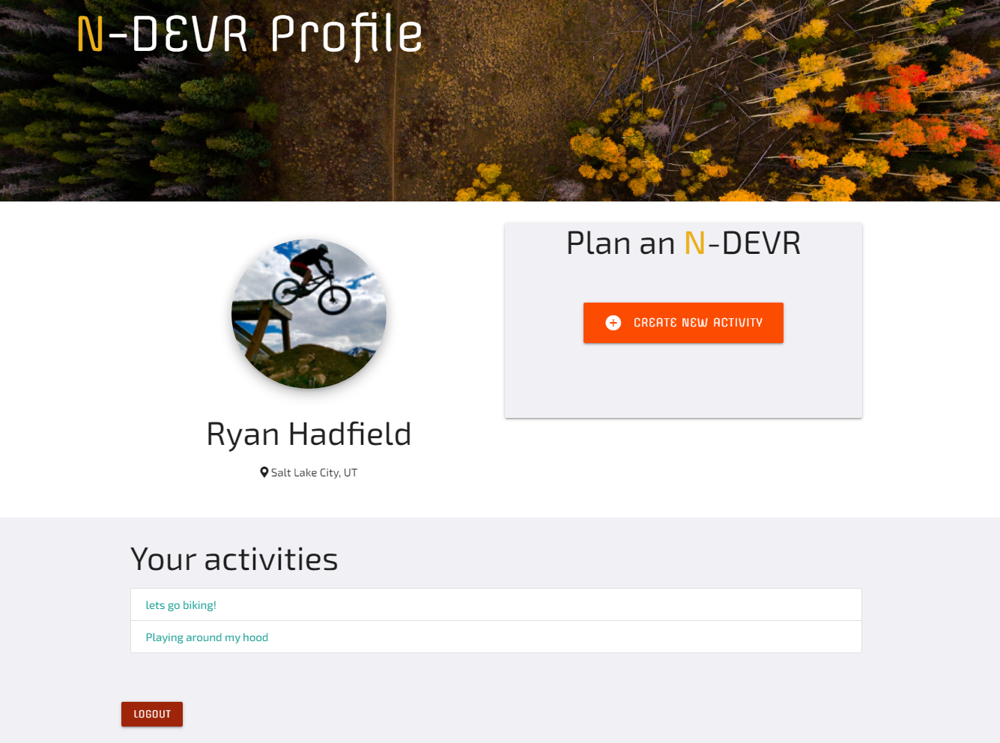

# N-DEVR

This app will use the [Strava API](https://developers.strava.com/) to retrieve user data as well as Strava's segment data.  We are using a polyline encoder to display the segment data on a map.  The user will select segments on the map to build and plan their activity.

## Description

N-DEVR aims to help adventure seekers plan out their outdoor activities & endeavors. Our team's mission is to easily allow our active outdoor community to plan, organize, and include friends in outdoor pursuits and goals.

N-DEVR is powered by [Strava ](https://www.strava.com/) and enables it's 50+ million athletes to connect and plan their activities.

Once the user logs into N-DEVR they will be directly to their user profile page.  This page will show the user their name and location information as well as their profile pic. From the user profile page the user can see a list of previously created activities as well as create new activities.

## Built With

- [Materialize CSS](https://materializecss.com/)
- [JQuery](https://jquery.com/)
- [Google Fonts](https://fonts.google.com/)
- [Font Awesome](https://fontawesome.com/)
- [Favicon](https://favicon.io/)
- [CanvasJS](https://canvasjs.com/)
- [MomentJS](https://momentjs.com/)
- [PassportJS](http://www.passportjs.org/)
- [HandlebarsJS](https://handlebarsjs.com/)
- [LeafletJS](https://leafletjs.com/)
- [NodeJS](https://nodejs.dev/)
- [ExpressJS](https://expressjs.com/)
- [Sequelize](https://sequelize.org/)
- [MySQL](https://www.mysql.com/)
- [Material Icon CDN](https://material.io/resources/icons/?style=baseline)
- [AOS](https://michalsnik.github.io/aos/)
- [Polyline-encoded](https://github.com/jieter)

## Link to Site

[Click to plan your next N-DEVR](https://ndevr.herokuapp.com/)

## Screenshots

## Authors

### Paul Vatterott

[Github](https://github.com/pfvatterott)  
Email: pfvatterott@gmail.com

### Ryan Hadfield

[Github](https://github.com/ryanhadfield)  
Email: ryan.hadfield@gmail.com

## License

MIT License

Copyright (c) 2021 Paul Vatterott & Ryan Hadfield

Permission is hereby granted, free of charge, to any person obtaining a copy of this software and associated documentation files (the "Software"), to deal in the Software without restriction, including without limitation the rights to use, copy, modify, merge, publish, distribute, sublicense, and/or sell copies of the Software, and to permit persons to whom the Software is furnished to do so, subject to the following conditions:

The above copyright notice and this permission notice shall be included in all copies or substantial portions of the Software.

THE SOFTWARE IS PROVIDED "AS IS", WITHOUT WARRANTY OF ANY KIND, EXPRESS OR IMPLIED, INCLUDING BUT NOT LIMITED TO THE WARRANTIES OF MERCHANTABILITY, FITNESS FOR A PARTICULAR PURPOSE AND NONINFRINGEMENT. IN NO EVENT SHALL THE AUTHORS OR COPYRIGHT HOLDERS BE LIABLE FOR ANY CLAIM, DAMAGES OR OTHER LIABILITY, WHETHER IN AN ACTION OF CONTRACT, TORT OR OTHERWISE, ARISING FROM, OUT OF OR IN CONNECTION WITH THE SOFTWARE OR THE USE OR OTHER DEALINGS IN THE SOFTWARE.
